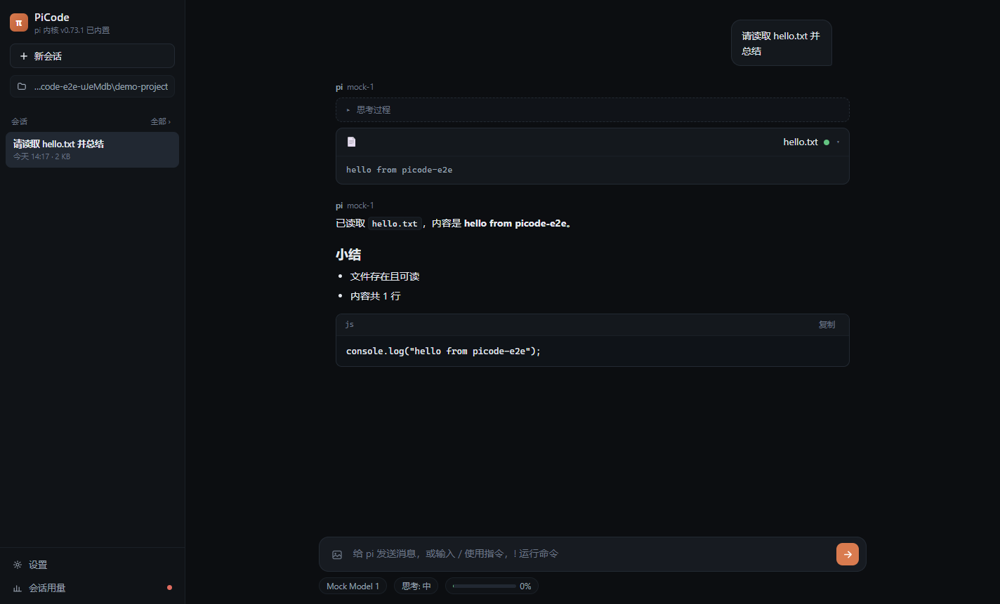
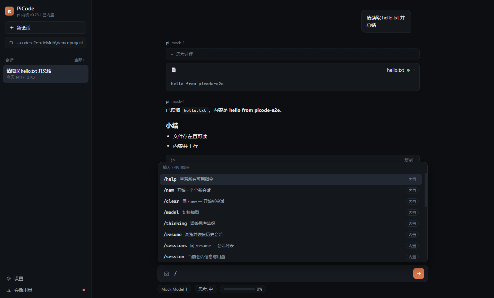
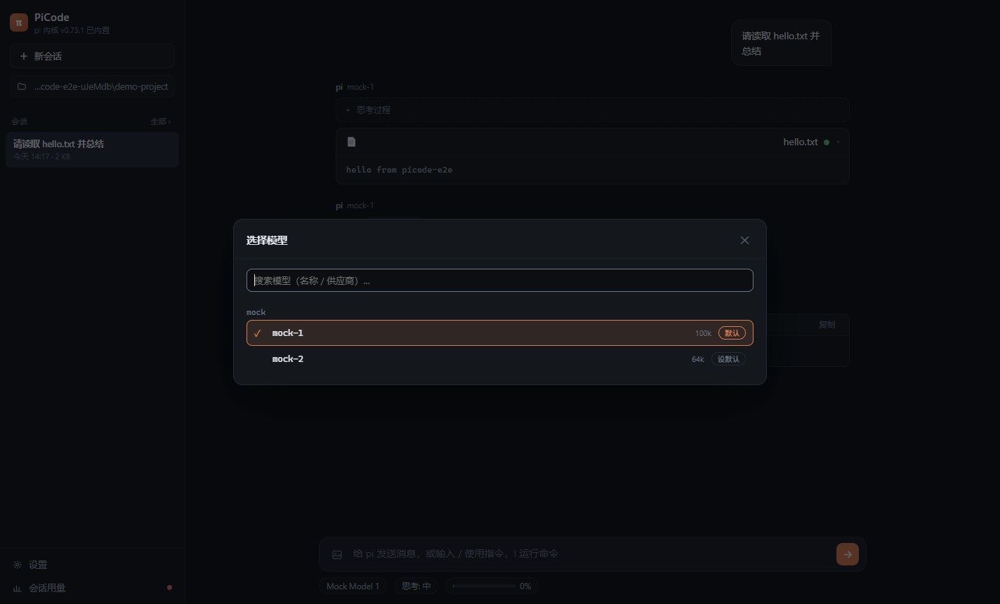
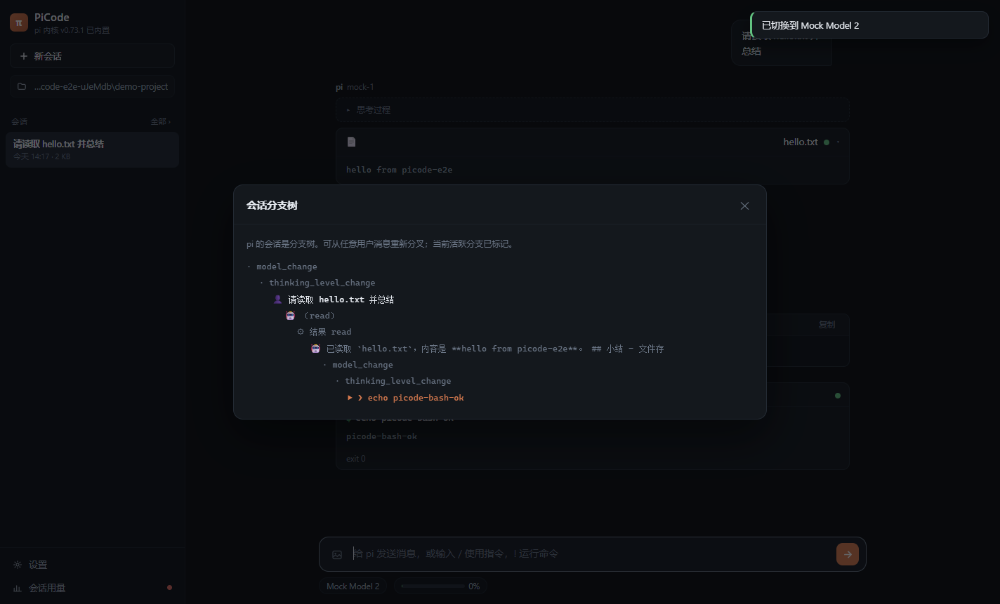

<div align="center">

# π PiCode

**为 [pi 编程助手](https://github.com/badlogic/pi-mono) 打造的 Codex 风格桌面 GUI**

一个安装包，双击安装、打开即用 —— 无需 Node.js，无需 WSL，无需碰命令行。

`Electron` · `pi --mode rpc` · `MIT`

</div>

---

PiCode 通过 pi 官方的 **RPC 模式**驱动一个**真正的、完整内嵌的 pi 进程**，因此 pi 的一切能力（工具调用、会话、模型、扩展、技能、`/` 指令）都是原生行为，PiCode 只是它的桌面外壳。

## 截图

| | |
|---|---|
|  |  |
| 流式 Markdown + 思考过程 + 工具卡片 | 输入 `/` 唤起指令面板（内置 + pi 扩展/模板/技能） |
|  |  |
| 可搜索的模型选择器（一键设默认） | 会话分支树（pi 的会话是分支树） |

## 安装（给使用者）

从 [**Releases**](../../releases) 下载 `PiCode-Setup-x.y.z.exe`，双击安装：

1. 安装完成自动启动，桌面出现「PiCode」快捷方式
2. 首次使用：选择一个项目文件夹 → 设置里粘贴任意供应商的 API 密钥 → 开始对话
3. 密钥保存在 pi 自己的 `auth.json`（`~/.pi/agent/auth.json`），**与命令行版 pi 完全通用**；也可以用环境变量（如 `ANTHROPIC_API_KEY`）

> 安装包未做代码签名，SmartScreen 首次会提示「更多信息 → 仍要运行」，属正常现象。

## 功能

- **完整的 pi 会话体验**：流式 Markdown、思考过程（可折叠）、工具卡片（read / bash / edit 带 diff 视图 / write / grep / find / ls）、图片输入（粘贴 / 拖拽 / 附件）
- **输入框完整继承 pi 的 `/` 指令**，输入 `/` 唤起面板：
  - 内置指令映射到 RPC 能力：`/new` `/model` `/thinking` `/resume` `/session` `/compact` `/name` `/fork` `/clone` `/tree` `/export` `/extensions` `/settings` `/reload` `/help`
  - pi 的**扩展命令、提示模板、技能**（`/skill:name`）由 `get_commands` 动态获取、原样透传给 pi 执行
  - `!命令` 直接运行 shell，输出进入对话上下文（等价 pi 的 `!` 前缀）
- **模型与思考等级**：可搜索选择器（`Ctrl+P`）、思考等级切换、一键设为默认
- **会话管理**：按项目列出历史会话（与命令行版互通）、切换 / 删除 / 分叉 / 克隆 / 重命名 / 导出 HTML / 分支树
- **上下文与用量**：上下文水位条、token / 费用统计、自动压缩开关、压缩与重试事件提示
- **扩展 UI 全支持**：扩展弹出的 select / confirm / input / editor 对话框、notify 通知、状态条、widget、窗口标题、编辑器预填
- **多项目**：侧边栏一键切换项目文件夹，最近项目快速恢复
- **深色 / 浅色主题**

## 它是如何工作的

```
┌──────────────────────────── Electron ────────────────────────────┐
│  Codex 风格渲染层  ⇄ (IPC)  ⇄  主进程 RPC 桥 (JSONL over stdio)    │
└──────────────────────────────────────────────────────────────────┘
                                      │  ELECTRON_RUN_AS_NODE
                                      ▼
                    内嵌的 pi CLI（pi --mode rpc，工作目录 = 项目文件夹）
```

- pi 进程由 **Electron 自带的 Node 运行时**启动（`ELECTRON_RUN_AS_NODE=1` + 内嵌的 `@mariozechner/pi-coding-agent`），目标机器不需要任何额外运行时
- pi 的配置、密钥、会话、扩展、技能都在它的标准位置（`~/.pi/agent` 与项目 `.pi/`），GUI 与命令行版 pi 完全互通
- 针对 pi 0.73.x 的 RPC 差异做了兼容：`get_tree` 缺失时直接解析会话 JSONL 绘制分支树、`get_available_thinking_levels` 缺失时按模型能力推导、未知命令的无 id 错误响应可正确关联

## 项目结构

```
picode/
├── src/
│   ├── main/           # Electron 主进程
│   │   ├── main.ts     # 窗口、IPC、生命周期
│   │   ├── rpc.ts      # pi RPC 桥（严格 JSONL 分帧、请求关联、超时）
│   │   ├── sessions.ts # 会话索引 + 分支树解析（get_tree 降级）
│   │   └── config.ts   # pi 配置读写（auth.json / settings.json）
│   ├── preload/        # contextBridge 桥接
│   └── renderer/       # Codex 风格前端（原生 TS，无框架）
│       ├── app.ts      # 聊天 / 流式渲染 / 斜杠面板 / 全部对话框
│       ├── markdown.ts # marked + highlight.js + DOMPurify
│       └── style.css   # 主题（深/浅色 CSS 变量）
├── scripts/
│   ├── build.mjs       # esbuild 打包主进程/preload/渲染层
│   ├── make-icons.mjs  # 纯 JS 生成 PNG/ICO 图标
│   ├── smoke-rpc.mjs   # 对内嵌 pi 的协议冒烟测试
│   ├── mock-llm.mjs    # Anthropic Messages 协议的 mock 模型
│   └── e2e.mjs         # Electron 端到端测试（CDP 驱动 + 截图）
└── electron-builder.yml
```

## 从源码构建

```bash
npm install          # 安装依赖（含内嵌 pi）
npm run icons        # 生成图标（build/icon.ico）
npm run build        # esbuild 打包
npm run smoke:rpc    # RPC 协议冒烟测试（无需 API key）
npm run test:e2e     # 端到端测试：内置 mock 模型，免 key 免费跑 + 截图
npm run dist         # 产出 release/PiCode-Setup-x.y.z.exe
```

要求：Node.js ≥ 20（仅构建时需要；最终用户不需要）。端到端测试通过 `--remote-debugging-port` 用 CDP 驱动真实 Electron 窗口，全部用例不消耗任何 API 费用。

## 改动指南（给协作者）

- **想改界面**：`src/renderer/app.ts`（逻辑）+ `style.css`（主题）；UI 是原生 TS，无框架依赖
- **想升级 pi**：改 `package.json` 里 `@mariozechner/pi-coding-agent` 的版本 → `npm install` → `npm run test:e2e`（若 pi 新版实现了 `get_tree` / `get_available_thinking_levels` / `clear_queue`，会自动优先走 RPC，降级逻辑仍保留）
- **想加内置 `/` 指令**：`src/renderer/app.ts` 的 `BUILTINS` 数组，一个对象一条指令
- **协议问题先查文档**：`pi --mode rpc` 的协议见 pi 仓库 `packages/coding-agent/docs/rpc.md`；调试可开 设置 → 查看运行日志（pi 的 stderr）

## 已知边界

- pi 的 `/login` OAuth 是终端专属，GUI 用「设置 → API 密钥 / 环境变量」替代；订阅型 OAuth 请用命令行 pi 登录后，GUI 直接共用其凭据
- `/share`（上传分享）未内嵌，可用 `/export` 导出 HTML
- 打包内置 pi 版本见 `package.json`

## 许可

MIT。内嵌的 pi（badlogic/pi-mono）同为 MIT。
